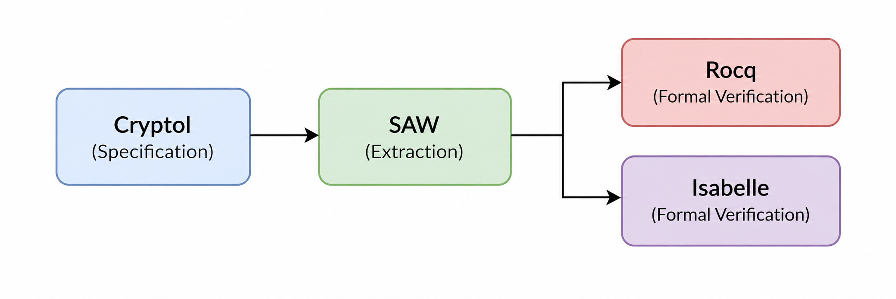

# Automated Reasoning for Cryptography

Work of the University at Albany INSuRE+E team on formal verification of
cryptographic specifications using **Cryptol**, **SAW**, and interactive proof
assistants.

**Cryptol Specification → SAW → Rocq / Isabelle → Formal Verification**



This is the single README for the repository. Everything about running the
experiments lives here; the longer background documents are in [docs/](docs/).

**Contents** — [Goal](#goal) · [Layout](#repository-layout) ·
[Quick start](#quick-start) · [Running SAW](#running-saw) ·
[Isabelle](#isabelle) · [Rocq](#rocq) · [Outputs](#outputs) ·
[Results](#results) · [Limitations](#known-limitations) ·
[Git workflow](#git-workflow) · [Team](#team)

---

## Goal

During the training phase the objective is **not** to verify a complete
cryptographic algorithm. It is to establish a **reproducible toolchain** and
understand how a Cryptol specification actually moves through SAW into a
proof-assistant representation:

```
Example.cry -> Cryptol -> SAW 1.6 -> Isabelle extraction -> Example.thy
```

Once that works, we compare the more mature **Rocq** extraction with the newer
experimental **Isabelle** one and choose the path for the real cryptographic
target.

Full detail: [docs/implementation-guide.md](docs/implementation-guide.md).

## Tools

| Tool | Role | Version |
| --- | --- | --- |
| Cryptol | Cryptographic specification language | bundled with SAW |
| SAW | Loads Cryptol, emits proof-assistant theories | **1.6** (`ghcr.io/galoisinc/saw:1.6`) |
| Isabelle | Interactive theorem prover | Isabelle2024+ |
| Rocq | Proof assistant (formerly Coq) | TBD |
| Docker | Reproducible environment | any recent |

SAW is pinned so all four of us run the same build. If you change the image,
say so in a `results/` file.

## Repository layout

```
automated-reasoning-cryptography/
├── README.md                       # you are here
├── img/pipeline.png
├── examples/Example.cry            # Cryptol source specifications
├── saw/                            # SAW scripts + the docker launcher
├── isabelle/                       # hand-written Isabelle proof material
├── rocq/                           # hand-written Rocq proof material
├── outputs/
│   ├── isabelle/                   # GENERATED - Example.thy lands here
│   └── rocq/                       # GENERATED
├── docs/
│   ├── implementation-guide.md     # the full project guide
│   ├── setup.md                    # Windows/WSL2 + Linux setup
│   └── training-notes.md           # running log + Rocq/Isabelle comparison
└── results/                        # one file per experiment run
```

The split that matters: `examples/` and `saw/` are **inputs we write**,
`outputs/` is **what the tool produces**, and `results/` is **what happened
when we ran it**. Keeping generated files out of the hand-written directories
is what makes a later diff meaningful.

## Quick start

Prerequisite: Docker, and on Windows a WSL2/Ubuntu shell. See
[docs/setup.md](docs/setup.md) — budget an hour the first time.

```bash
git clone https://github.com/HwnagYujeong0808/automated-reasoning-cryptography.git
cd automated-reasoning-cryptography

docker pull ghcr.io/galoisinc/saw:1.6
./saw/run-saw.sh saw/extract_isabelle.saw
```

Expected result:

```
outputs/isabelle/Example.thy
```

That is the **minimum successful outcome** of the first experiment. Then copy
`results/experiment-template.md` and write down what happened.

Run every command from the repository root, in Bash — WSL/Ubuntu on Windows,
not PowerShell.

## The example specification

[examples/Example.cry](examples/Example.cry), provided by the problem mentor,
holds four ring-arithmetic laws: addition associativity, addition
commutativity, left distributivity, right distributivity.

The point is not to study these properties. They are a small, readable
specification that exercises the whole pipeline — and being polymorphic over
`Ring a`, they also tell us something about how SAW handles Cryptol's type
classes during translation.

## Running SAW

| File | Purpose |
| --- | --- |
| [saw/run-saw.sh](saw/run-saw.sh) | Starts the SAW 1.6 container with the repo mounted |
| [saw/extract_isabelle.saw](saw/extract_isabelle.saw) | Non-interactive Isabelle extraction (Experiment 1) |
| [saw/extract_rocq.saw](saw/extract_rocq.saw) | Placeholder — command not yet verified |

### By hand

`run-saw.sh` only automates the interactive session. To follow the mentor's
original steps:

```bash
CUSER="saw"
WD="/home/$CUSER/$(basename "$PWD")"

docker run --rm -it \
  -u "$CUSER" \
  -v "$PWD:$WD" \
  -w "$WD" \
  -e "CRYPTOLPATH=$WD" \
  ghcr.io/galoisinc/saw:1.6
```

Then at the `sawscript>` prompt:

```
sawscript> Example <- cryptol_load "examples/Example.cry"
sawscript> Example
sawscript> enable_experimental
sawscript> :h write_isabelle_cryptol_modules
sawscript> write_isabelle_cryptol_modules [Example] [] "outputs/isabelle"
```

Printing `Example` should list `add_assoc_l`, `add_comm`, `dist_l`, `dist_r`.
If they appear, the `Cryptol -> SAW` half of the pipeline works.

### Useful REPL commands

| Command | What it does |
| --- | --- |
| `enable_experimental` | Unlocks the experimental commands, including Isabelle extraction |
| `:env` | Lists every command in scope — use this to find the Rocq command name |
| `:h <name>` | Prints help and argument types for one command |
| `:?` | Lists the REPL's own commands |
| `:q` | Quits |

### Gotchas

- `write_isabelle_cryptol_modules` is **experimental**; it exists only after
  `enable_experimental`, and every new SAW session needs it again.
- Its third argument is the output directory, relative to the container's
  working directory — which `run-saw.sh` sets to the repo root, so
  `"outputs/isabelle"` lands in the repo. The directory must exist;
  `run-saw.sh` creates it for you.
- `CRYPTOLPATH` points at the repo root so `import`s inside a Cryptol module
  resolve against the repository.
- Paths are the usual source of confusion: what you type in SAW is a
  *container* path, but the file appears on the host because of the mount.

More troubleshooting: [docs/setup.md](docs/setup.md#troubleshooting).

## Isabelle

The Isabelle extraction in SAW 1.6 is **experimental** and newer than the Rocq
path. The mentor demonstrated extraction only; nobody has attempted the proofs
on the generated theory. Both halves are open work for us.

**Minimum goal — extraction.** Produce `outputs/isabelle/Example.thy`.

**Stretch goal — proof.** Load the theory in Isabelle
([isabelle.in.tum.de](https://isabelle.in.tum.de/)), resolve its support-library
dependency, and prove one property. Start with `add_comm` or `add_assoc_l`.

### The `Cryptol.Cryptol` dependency

The generated theory starts with something like:

```isabelle
theory "Example"
  imports "Cryptol.Cryptol"
begin
context includes cryptol_translation_syntax begin
...
end
end
```

`Cryptol.Cryptol` is **not** part of a stock Isabelle install. It is the
support library the translation targets, and locating it is the first real task
of the stretch goal. Look, in order:

1. Inside the SAW container — search for `Cryptol.thy` or a `ROOT` file naming
   a `Cryptol` session:
   ```bash
   ./saw/run-saw.sh find / -name "*.thy" -path "*ryptol*" 2>/dev/null
   ```
2. The `saw-script` repository, near the Isabelle translation code.
3. Ask the problem mentor. He wrote the example; he knows where the library
   lives. That is a reasonable thing to ask rather than reverse-engineer.

Register it by adding its directory to `~/.isabelle/Isabelle2024/ROOTS`, or by
passing `-d <dir>` to `isabelle jedit`. Record what you find in
[docs/training-notes.md](docs/training-notes.md) — this is exactly the kind of
undocumented setup step the project is meant to surface.

On Windows you can run the native Isabelle build even though SAW runs inside
WSL: the generated `.thy` file is in the repo, reachable from both sides.

### Proof attempt checklist

1. Does the theory parse at all? Any syntax errors in the generated output?
2. Do the four definitions appear, and do their types look right?
3. Take `add_comm`. Try, in order: `by simp`, `by auto`, `by algebra`,
   `sledgehammer`.
4. Record what worked, and whether it was automatic or needed a human.
5. If a property is *false* as generated (say, a type constraint was dropped in
   translation), that is a finding worth writing up, not a failure to hide.

The point is to measure how much manual proof work remains after extraction —
not to collect a green checkmark.

## Rocq

Not started. The mentor described SAW's Rocq extraction as **more mature** than
the Isabelle path, but gave us a known-good command sequence only for Isabelle.
So we reproduce Isabelle first, work out the Rocq equivalent second, compare
third.

### Finding the extraction command

SAW's Coq/Rocq support has changed command names across versions. Don't trust a
name from an older tutorial — confirm it against this build:

```bash
./saw/run-saw.sh
```

```
sawscript> enable_experimental
sawscript> :env
```

Scan for commands containing `coq` (historically `write_coq_term`,
`write_coq_cryptol_module`, and related forms), then `:h <command>` for its
exact argument list. Write the verified command into
[saw/extract_rocq.saw](saw/extract_rocq.saw), which is currently a placeholder.

Expect the same class of problem as `Cryptol.Cryptol`: generated Rocq files
depend on a support library (the SAW Coq backend has historically targeted
`CryptolToCoq`), so the file will not compile against a bare Rocq install.
Finding and pinning that library is part of the experiment.

Then: extract to `outputs/rocq/Example.v`, get it to compile, prove `add_comm`,
and fill in the comparison table in
[docs/training-notes.md](docs/training-notes.md).

## Outputs

Everything under `outputs/` is **generated by SAW**. Do not hand-edit it.

Generated files **are** committed, on purpose: the diff between two members'
output, or between two SAW versions, is evidence about the toolchain, which is
what this project studies.

If you must modify a generated file to make a proof go through, copy it into
`isabelle/` or `rocq/` first, edit the copy, and document the change in
`results/`:

- What was changed?
- Why?
- Required for extraction, or only for the proof?
- Can another member reproduce it from your notes alone?

Reproducibility is a project deliverable; a silently patched file destroys it.

## Results

One file per experiment run, named `results/NN-short-name-yourname.md`, copied
from [results/experiment-template.md](results/experiment-template.md). Fill it
in while you run, not from memory, and paste real terminal output rather than
paraphrasing — exact error text is what lets someone else recognize the same
failure.

A failed run with a good transcript is worth more to this project than a
success with no notes.

| # | Experiment | Member | Date | Extraction | Proof |
| --- | --- | --- | --- | --- | --- |
| 01 | Cryptol → SAW → Isabelle | _TBD_ | _TBD_ | _TBD_ | _TBD_ |
| 02 | Cryptol → SAW → Rocq | _TBD_ | _TBD_ | _TBD_ | _TBD_ |

Worth recording: it worked end to end; it worked but needed a manual step; the
output would not load in the proof assistant; SAW rejected a Cryptol construct;
or the same steps behaved differently on someone else's machine. That last one
matters most — reproducibility across our four machines is a deliverable.

## Known limitations

Reported by the problem mentor for the current extraction support:

- Recursive functions
- Parameterized modules requiring wrappers
- Infinite / stream types

Record it whenever one of these shows up. The cryptographic specification we
eventually target has to be compatible with the extraction pipeline, so a spec
built on unsupported recursion is a bad first choice however interesting it is
otherwise.

## Git workflow

GitHub stores the specifications, scripts, generated files, docs, results and
notes — but it is not where the work runs:

```
GitHub -> git clone/pull -> your machine -> Docker -> SAW -> results -> git push -> GitHub
```

```bash
git pull
git checkout -b yujung/isabelle-extraction
# run the experiment, write the results file
git add .
git commit -m "Reproduce Cryptol to Isabelle extraction"
git push origin yujung/isabelle-extraction
```

Then open a pull request. Four people editing the same files directly on `main`
is the failure mode this avoids.

## Current status

| Stage | Status |
| --- | --- |
| Repository scaffolding | Done |
| Docker + SAW 1.6 environment | Not yet verified by the team |
| Experiment 1 — Isabelle extraction | Not started |
| Experiment 2 — Rocq extraction | Not started |
| Isabelle proof attempt | Not started |
| Proof-assistant decision | Blocked on Experiments 1 and 2 |

## Team

**University at Albany — INSuRE+E Team 1**

**Problem Mentor:** Matt Benke
**Faculty Advisor:** Dr. Sanjay Goel
